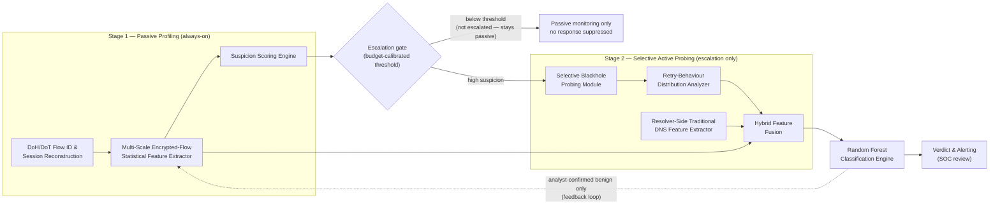

# AdaptDNS — Architecture Design of the Proposed Work 

**Computer Networks · Team:** Gracy Mehndiratta (24BCE2987), Tejas Venjane (24BCE0308), Manan Kulshrestha (24BCE0262)

AdaptDNS is a hybrid, **two-stage detection framework** for DNS tunneling over encrypted DNS (DoH/DoT), addressing three gaps in the base paper [1]: validation only on unencrypted DNS-over-UDP, blackhole probing without a selective pre-filtering stage, and no evaluation against an adaptive tunneling client that reshapes retry timing.

**Deployment assumption:** AdaptDNS sits at an enterprise recursive resolver or a controlled DoH/DoT gateway that terminates TLS for its own clients. Stage 1 uses only encrypted-flow connection metadata; Stage 2 additionally requires resolver-side visibility (response suppression + decrypted DNS semantics) — not achievable by a bare on-path observer.

## Architecture



Two paths run in parallel on an escalated flow (blackhole probing and
resolver-side DNS-feature extraction); fusion combines them with the Stage-1
passive features. The feedback loop updates **only** the benign baseline —
confirmed-malicious detections go to a separate signature path.

## Code ↔ document mapping

| Case study component | Code |
|---|---|
| DoH/DoT Flow Identification & Session Reconstruction | `adaptdns/stage1/flow_id.py` |
| Multi-Scale Encrypted-Flow Statistical Feature Extractor | `adaptdns/stage1/features.py` |
| Suspicion Scoring Engine | `adaptdns/stage1/scoring.py` (Mahalanobis distance from benign population) |
| Suspicion / Escalation-Budget Decision | `adaptdns/escalation.py` |
| Selective Blackhole Probing Module | `adaptdns/stage2/blackhole.py` |
| Retry-Behaviour Distribution Analyzer | `adaptdns/stage2/retry.py` (distributions + KS distance vs baseline, not point ratios) |
| Resolver-Side Traditional DNS Feature Extractor | `adaptdns/stage2/dns_features.py` (exactly 11 features, runs in parallel with probing) |
| Hybrid Feature Fusion | `adaptdns/fusion.py` |
| Random Forest Classification Engine | `adaptdns/classifier.py` |
| Detection Verdict & Alerting | `adaptdns/classifier.py` (`verdicts()`) |
| Baseline Update (feedback loop) | `adaptdns/baseline.py` (benign baseline ⟂ signature store) |
| End-to-end orchestration | `adaptdns/pipeline.py` |
| Synthetic traffic (benign / naive tunnel / adaptive tunnel) | `adaptdns/synthetic/generator.py` |
| **Base-paper point-ratio blackhole features** (comparison baseline [1]) | `adaptdns/stage2/point_ratio.py` |
| **Red-team attack strength** (`Config.attack_strength`) | `adaptdns/synthetic/generator.py` |
| **Evaluation studies** (budget / robustness / multi-seed) | `experiments/study.py` |
| **REAL DoH gateway with actual blackhole suppression** | `gateway/doh_gateway.py` |
| **Live dashboard** (synthetic stream / gateway tail) | `experiments/live_demo.py` |
| PCAP ingestion (real captures, later) | `adaptdns/pcap/ingest.py` |

**Selection-bias control:** the classifier is trained and evaluated only on
flows produced through the same Stage-1 gating process (§3.4 of the case
study) — calibration, training and test benign splits are disjoint.

## Setup

```bash
python3 -m venv .venv
.venv/bin/pip install -e .
# optional, for real pcap ingestion:
.venv/bin/pip install scapy
```

## Run the experiment

```bash
.venv/bin/python experiments/run_demo.py            # full run + plots
.venv/bin/python experiments/run_demo.py --budget 0.10 --seed 1

# Evaluation studies (CSV + figures under artifacts/)
.venv/bin/python experiments/study.py seeds         # headline mean ± std over N seeds
.venv/bin/python experiments/study.py budget        # escalation-budget sweep
.venv/bin/python experiments/study.py robustness    # red-team strength sweep  ← key figure
.venv/bin/python experiments/study.py all

# Live dashboard
.venv/bin/python experiments/live_demo.py           # stream unseen flows, live verdicts
.venv/bin/python experiments/live_demo.py --gateway # tail the real gateway's probes

# REAL DoH gateway (actual response suppression + real retry timing)
python gateway/doh_gateway.py
curl --doh-url https://127.0.0.1:8443/dns-query -k --doh-insecure https://example.com
curl -k -X POST http://localhost:9080/admin/blackhole -d '{"pattern": "example.com"}'
curl -k http://localhost:9080/admin/flows          # observed retry delays

.venv/bin/python -m pytest tests/ -q                # test suite (11 tests)
```

Plots are written to `artifacts/` (`confusion_matrix.png`,
`feature_importances.png`, `sweep_budget.png`, `sweep_robustness.png`).

## Reference results

**Headline (seed 42, budget 5 %):** benign escalation 4.79 % (budget
respected), Stage-2 F1 = 1.000, end-to-end false-alert rate 0 %.

### Head-to-head: base paper vs AdaptDNS retry features

Both formulations see the SAME probe trace; only the retry representation
differs (scalar point values [1] vs distributions + order/shape statistics).
At full strength the adaptive attacker forges the *levels* — retry count,
first delay, mean/max drawn from the benign distributions, plus benign-like
pacing, sizes and flow scope — verified by single-feature AUCs ≈ 0.5 on all
point statistics.

Adversary strength 1.0, mean over 3 seeds, detection rate **on adaptive
flows only** (the gated test split):

| Feature group | adaptive detection | overall F1 |
|---|---|---|
| point-ratio retry (base paper [1]) | **0.19 ± 0.14** | 0.939 ± 0.007 |
| **retry distributions (AdaptDNS §3.3)** | **0.25 ± 0.15** | 0.944 ± 0.010 |
| passive encrypted-flow (Stage 1) | 0.46 ± 0.17 | 0.955 ± 0.012 |
| resolver-side DNS (11 features) | **1.00 ± 0.00** | 1.000 ± 0.000 |
| base-paper composite (DNS + point-ratio) | 1.00 ± 0.00 | 1.000 ± 0.000 |
| **fused AdaptDNS (of gated flows)** | **1.00 ± 0.00** | 1.000 ± 0.000 |

Reading the table honestly: at full strength *both* retry representations
are severely degraded — the distributions keep a consistent edge (better at
strengths 0.25, 0.50 and 1.00, tied within noise at 0.75; see the sweep
below), and the fusion plus resolver-side DNS features are what recover the
detection. The per-seed variance on the retry rows is large because the
budget gate admits few adaptive flows at full strength — the gate, not the
classifier, is the limiting factor (row 2 of the sweep below).

F1 overall stays ≈0.94 even at full strength because the naive half of the
tunnel population remains trivially detectable in every configuration.

### Robustness sweep (`study.py robustness`, mean over 3 seeds)

| attack strength | gate recall (adaptive) | point-ratio | **distributions** | passive | **DNS (resolver)** | end-to-end |
|---|---|---|---|---|---|---|
| 0.00 (naive) | 1.00 | 1.00 | 1.00 | 1.00 | **1.00** | 1.00 |
| 0.25 | 1.00 | 0.88 | **0.90** | 1.00 | **1.00** | 1.00 |
| 0.50 | 1.00 | 0.81 | **0.82** | 1.00 | **1.00** | 1.00 |
| 0.75 | 1.00 | 0.81 | 0.80 | 1.00 | **1.00** | 1.00 |
| 1.00 | 0.15 | 0.19 | **0.25** | 0.46 | **1.00** | 0.57 |

Three findings this figure supports (all honest, none assumed):

1. **Distributional retry features degrade more gracefully than point
   ratios** — better at strengths 0.25, 0.50 and 1.00 (largest margin at
   full strength: 0.25 vs 0.19), tied within noise at 0.75 — the case
   study's design claim (§3.3) holds empirically.
2. **The escalation gate is the system's bottleneck against a
   metadata-mimicking adversary** (recall falls 1.00 → 0.15 at full
   strength). The case study explicitly states a low-suspicion classification
   "is not a proof of benignity" — this measures exactly how much that costs:
   end-to-end falls to 0.57 *because* of the gate, while Stage 2 still
   detects **100 % of what the gate escalates**.
3. **Resolver-side DNS features are unfakeable: 1.00 at every strength.**
   A client that still exfiltrates data through query names cannot hide
   their semantic fingerprints (length, entropy, TTL/qtype structure). This
   quantitatively validates the deployment assumption in §1 — the
   resolver/gateway position is what makes AdaptDNS robust when passive
   encrypted-flow features alone collapse (0.46).

> Results are on **synthetic** traffic; they validate the pipeline and the
> relative robustness claims above, not real-world accuracy. Robustness
> against a still-stronger adaptive adversary remains an evaluation target,
> not an assumed property (§5 of the case study).

### Real gateway observation (not simulated)

With `gateway/doh_gateway.py`, a real `curl --doh-url` client's
retransmissions after a genuinely suppressed response were measured at
**1.034 s, 2.040 s, 2.045 s** — resolver-side Stage-2 probing on live
traffic, matching the client's actual retry backoff.

## Where real pcaps plug in

`adaptdns.pcap.ingest.load_flows_from_pcap()` returns the same `Flow` objects
as the synthetic generator:

* **Plaintext DNS pcaps** → transactions parsed → Stage-2 DNS features work.
* **DoT/DoH pcaps** → connection metadata only; `txns` stays empty and the
  feature extractors degrade to zeros, matching the case study's discussion
  that Stage 2 needs resolver-side visibility.

## References

[1] W. S. Alorainy, “Echoes From the Void: Detecting DNS Tunneling With Blackhole Features in Encrypted Scenarios With High Accuracy,” *IEEE Access*, vol. 13, pp. 138551–138567, Aug. 2025, doi: 10.1109/ACCESS.2025.3595455.
[2] P. Hoffman and P. McManus, “DNS Queries over HTTPS (DoH),” RFC 8484, IETF, Oct. 2018.
[3] Z. Hu et al., “Specification for DNS over Transport Layer Security (TLS),” RFC 7858, IETF, May 2016.
[4] J. Bushart and C. Rossow, “Padding Ain’t Enough: Assessing the Privacy Guarantees of Encrypted DNS,” USENIX FOCI, 2020.
[5] M. Moure-Garrido et al., “Real time detection of malicious DoH traffic using statistical analysis,” *Computer Networks*, vol. 234, 2023.
